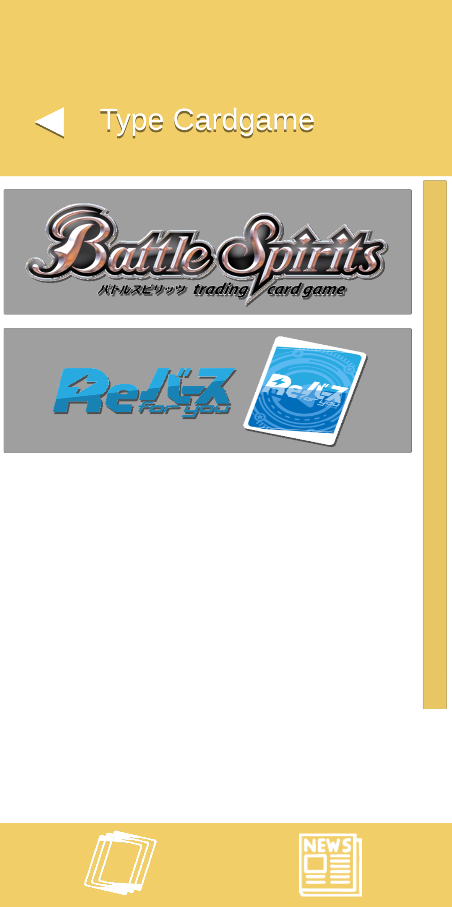
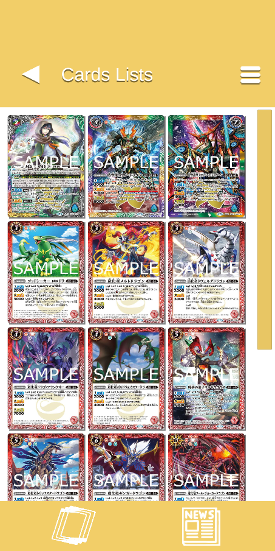
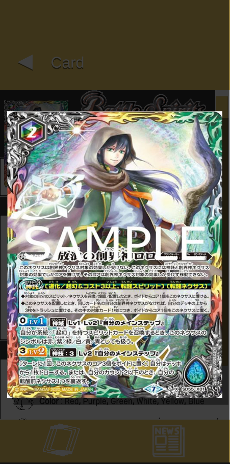
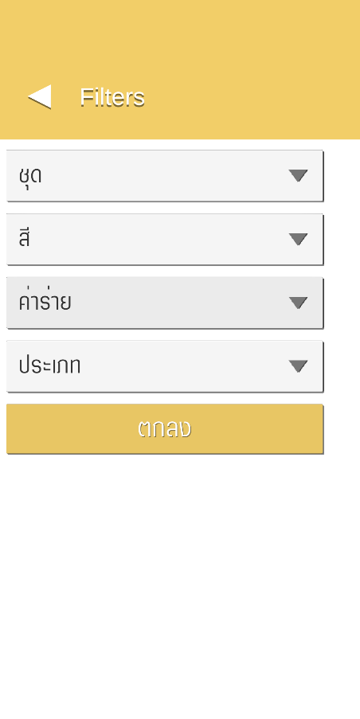
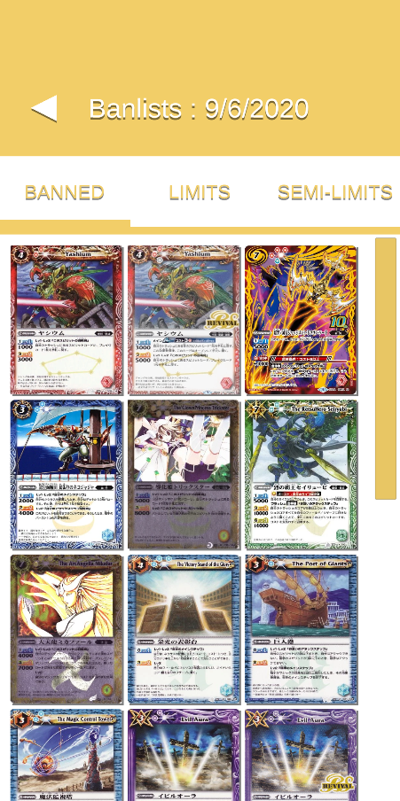
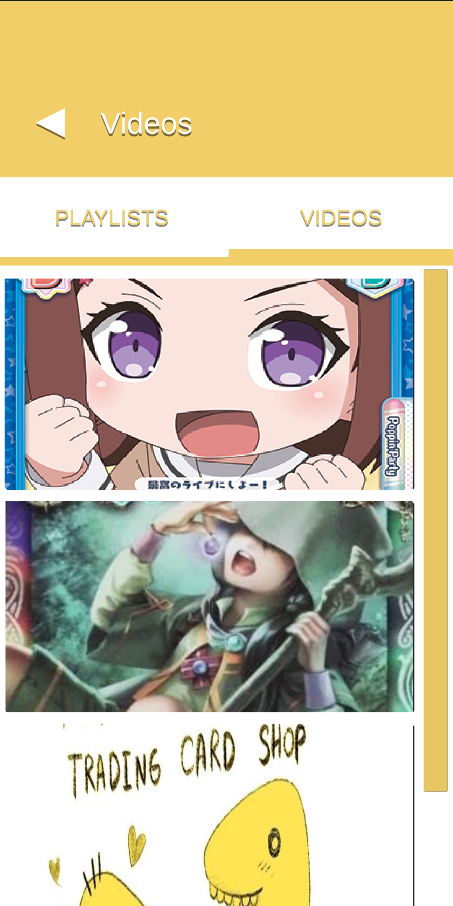

# StunFish-Card-Translate
StunFish Card Translate is an application that collects card game information, including news from web pages, videos and card translations.

<a href="https://drive.google.com/file/d/1Oz4FKAdzd8DL5JPuMjAMGeCbaB0iLf78/view?usp=sharing" target="[Download]">Google</a>

    
    
